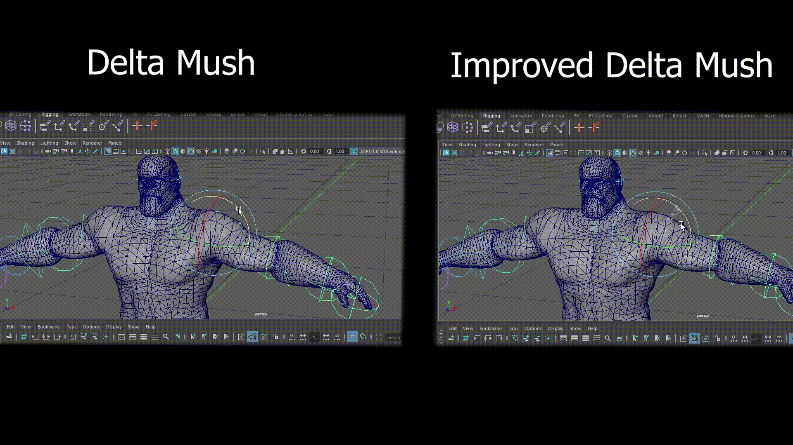

# MyMayaPlugin - Improved Delta Mush Maya Deformer

This repository contains a **Maya plugin** that implements the method from my paper for handling self-intersections in character animation.  
The implementation uses a third-party **Tight-Inclusion Continuous Collision Detection (CCD)** library to detect collisions and adaptively scale delta vectors. You can find more information in the paper.
(**Work in progress**) This project is under active development. Performance optimizations and bug fixes are ongoing.

**Paper:**  
[Improving Delta Mush Based Character Animation (CESCG 2025)](https://cescg.org/cescg_submission/improving-delta-mush-based-character-animation/)

**Original framework:**  
[Haragos99/sample-framework](https://github.com/Haragos99/sample-framework)

---

## About Delta Mush

**Delta Mush** is a mesh deformation algorithm that produces smooth, volume-preserving skinning results by applying **Laplacian smoothing** and then reintroducing the original surface details through **delta vectors**. It is widely used in character animation to obtain natural-looking deformations and to reduce artifacts such as collapsing joints. more info in the paper.

---

## Features

- Laplacian smoothing  
- Rest-delta computation  
- Self-intersection handling using a third-party **Tight-Inclusion CCD** library  
- CCD-based adaptive scaling of delta vectors (Improved Delta Mush)  
- UI controls to enable/disable the improved method and adjust smoothing / strength for collided points  
- Visualization toggles for collided faces, collided points, and delta vectors  

---

## Results

### DM vs IMD — Example 1
Difference between original Delta Mush (DM) and Improved Delta Mush (IMD). Collided faces are shown in **red**, collided points are shown in **purple**.  


### DM vs IMD — Example 2
Another comparison showing how IMD reduces self-intersection artifacts.  


### Linear Blend Skinning
A simple weighted LBS example without Delta Mush. (Used as the base for the above Delta Mush examples.)  


### UI: Feature Toggle & Strength Slider
Showcasing the plugin UI: toggle between original/improved Delta Mush and adjust the smoothing/strength slider.  


### Visualization of Delta Vectors
Visual debug view of delta vectors used to restore surface detail after smoothing.  


### Figures from the Paper
On each paper figure, the default Delta Mush result appears on the **left**, while the result using CCD-based scaling of delta vectors (the proposed method) appears on the **right**.


---

## Third-party libraries

- **Tight-Inclusion CCD** - collision detection used for self-intersection handling (external library)  
- **Eigen** - linear algebra / matrix computations  
- **spdlog** - logging  

---

## Dependencies

- Maya DevKit (2022–2026)  
- CMake ≥ 3.18  
- C++20 compatible compiler  
- Eigen (header-only)  
- Tight-Inclusion CCD (linkable library)  
- spdlog  

---

## Build

### Requirements
Make sure the Maya DevKit is installed and environment variables for the Maya SDK are set (e.g., `MAYA_API_DIR`, `MAYA_LOCATION`, or similar depending on your platform).

### Example build (out-of-source)

```bash
mkdir build
cd build
cmake .. -DCMAKE_BUILD_TYPE=Release
cmake --build . --config Release
